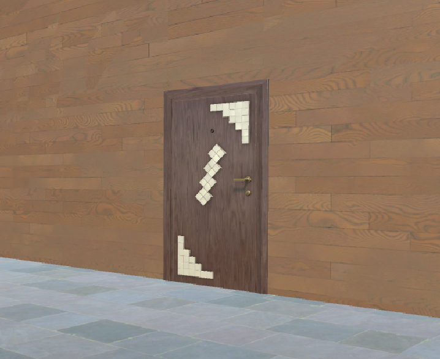
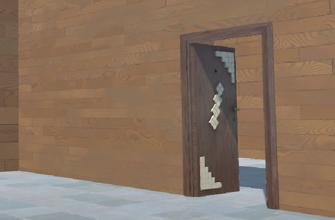

# Práctica 4: Uso de componentes en Unity3D 📌 <!-- omit in toc -->

> Esta práctica tiene objetivo aplicar interfaces naturales en componentes con Unity3D (cámara y micrófono). 

* Javier Correa Marichal (alu0101233598)
* Interfaces Inteligentes 21/22
* Universidad de La Laguna

- [Primer ejercicio - Micrófono](#primer-ejercicio---micrófono)
- [Segundo ejercicio - Cámara](#segundo-ejercicio---cámara)
- [Funcionamiento](#funcionamiento)

-----

### Primer ejercicio - Micrófono

Se ha implementado un script, incluido en el [repositorio](./src/MicrophoneController.cs), para la obtención de sonido desde el micrófono del ordenador. Este script fue asignado a un objeto destinado para el control de las reglas del juego, un GameObject al que hemos denominado `GameManager`. Para permitir un uso básico del micrófono, se implementó la siguiente funcionalidad en el script `MicrophoneController.cs` asociado a este:

```csharp
public class MicrophoneController : MonoBehaviour
{
    private AudioClip audioClip;

    void Start()
    {
        int min, max = 0;
        Microphone.GetDeviceCaps(null, out min, out max);
        Debug.Log(string.Format("Recording... (freq: {0})", max));
        audioClip = Microphone.Start(Microphone.devices[0], true, 999, 44100);
    }
```

Cuando comienza la simulación, el script comienza a grabar el sonido ambiente utilizando el micrófono seleccionado por defecto por el sistema operativo. Para permitir al usuario interactuar con el juego a través de este medio, decidimos que la mejor forma sería lanzar un evento cuando se detectase que el jugador emitiese un ruido lo suficientemente alto. Este evento luego sería conectado a otra funcionalidad en el juego, permitiendo una interacción más natural con el mismo. Para implementar esta funcionalidad, creamos el siguiente contenido en el método `Update()`:

```csharp
    public static event MicrophoneDelegate loudEvent;
    public static float MicVolume;
    public float threshold = -50f;

    void Update()
    {
        MicVolume = 20 * Mathf.Log10(Mathf.Abs(calculateVolume()));
        if (MicVolume > threshold) loudEvent();        
    }
```


En cada frame del juego, se calculará el nivel de ruido capturado por el micrófono. Si este ruido supera un cierto umbral, el evento es disparado. Para calcular el nivel de ruido (luego convertido a decibelios), se utilizó el método `calculateVolume()`:

```csharp
    private int sampleWindow = 128;

    float calculateVolume()
    {
        float levelMax = 0;
        float[] waveData = new float[sampleWindow];
        int micPosition = Microphone.GetPosition(null) - (sampleWindow + 1);
        if (micPosition < 0) return 0;
        audioClip.GetData(waveData, micPosition);
        // Getting a peak on the last 128 samples
        for (int i = 0; i < sampleWindow; i++) {
            float wavePeak = waveData[i] * waveData[i];
            if (levelMax < wavePeak) {
                levelMax = wavePeak;
            }
        }
        return levelMax;
    }
```

El evento creado fue posteriormente conectado con la animación de una puerta colocada en la escena. Esta puerta cuenta con una animación de apertura y de cerrado, la cual es activada cuando se dispara el evento asociado con la intensidad del volumen:

```csharp
    private Animation animation;
    private BoxCollider box;
    private bool isOpen;

    void Awake()
    {
        animation = GetComponent<Animation>();
        box = GetComponent<BoxCollider>();
    }

    void Start()
    {
        MicrophoneController.loudEvent += openDoor;
    }

    void openDoor()
    {
        if (!isOpen) 
        {
            isOpen = true;
            animation.Play("Door_Open");
            box.enabled = false;
            
        } 
        else if (isOpen)
        {
            isOpen = false;
            animation.Play("Door_Close");
            box.enabled = true;
        }
    }
```


### Segundo ejercicio - Cámara

Para la obtención de imágenes de la cámara del ordenador, se ha implementado un script que está incluido en el [repositorio](./src/WebcamController.cs). Este script utiliza la clase `WebCamTexture` que nos proporciona la propia plataforma de Unity, que realiza la traducción de la información obtenida de la cámara del ordenador a texturas 2D. Además, el script se le ha asignado a un objeto 3D cubo:

```csharp
public class WebcamController : MonoBehaviour
{

    private Renderer render;

    void Awake() 
    {
        render = GetComponent<Renderer>();
    }

    void Start()
    {
        WebCamTexture webcam = new WebCamTexture();
        render.material.mainTexture = webcam;
        webcam.Play();
    }
}
```


### Funcionamiento

El funcionamiento del código desarollado puede verse en el siguiente vídeo:

[](https://youtu.be/xYisqJESGj8)